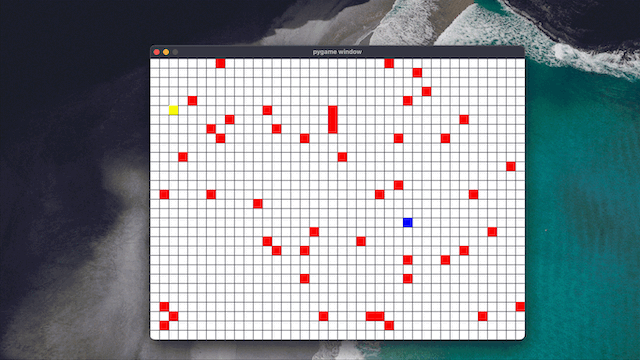

# SJSU Robotics Trial Project

My trial project submission for the Intelligent Systems division in the SJSU Robotics Club.



## Envrionment
Python 3.9.17</br>
Ubuntu 22.04.2 LTS arm64 (also tested on macOS 13.4; functions identically)

### Setup and How to Run
I used `pyenv` to manage my virtual environment. If you also happen to use pyenv, you can use the following commands to quickly set up an environment to run this project:
```bash
pyenv install 3.9.17
pyenv virtualenv 3.9.17 trialproject
pip install -r requirements.txt
```
Note: On macOS you may need to install `pyenv-virtualenv` with `brew install pyenv-virtualenv` before you can use the `pyenv virtualenv` command.

If you don't use pyenv, then you may choose to create a virtual environment on your own, or whatever may suit you. In any case, use `pip install -r requirements.txt` to install the required packages (there is only one, which is `pygame`).

</br>To run the project, simply run `python main.py`.

## AI Tool Use Disclosure
I used ChatGPT as an aid in this project. Namely, I used it to help in my understanding of the given code, understand how the A* algorithm works, and get a starting point for the implementation of the rover pathfinding. I acquired a ChatGPT-generated A* implementation, which I worked off of and modified to make it work better for this project. The links to my ChatGPT conversations are below:

[https://chat.openai.com/share/8a94d59f-04e4-4ee6-93be-ce5b4af7a303](https://chat.openai.com/share/8a94d59f-04e4-4ee6-93be-ce5b4af7a303)

[https://chat.openai.com/share/418e20c7-8a45-4b2e-98e1-0d22e24ebab5
](https://chat.openai.com/share/418e20c7-8a45-4b2e-98e1-0d22e24ebab5)

[https://chat.openai.com/share/eaed97f1-a565-4803-ab3d-64a5c2532726>](https://chat.openai.com/share/eaed97f1-a565-4803-ab3d-64a5c2532726)

## Approach to Each Task
I used the provided code as a starting point, and augmented it with an implementation of a starting point and ending goal, visualization of the trail, automatic pathfinding, and some other more minor features. I wrote descriptive commit messages for commits that represent a significant change. It may shed light on how exactly I augmented the code and what exactly I did in each of those augmentations. I highly recommend reading the commit messages to properly evaluate my work.

Apart from the commit messages, I address each of the task specifications below.

1.  Environment Setup:

-   Install Ubuntu 22.04 on your machine or a virtual machine (VM). Ensure Python 3.9 is installed and set as the default version.

Done.

2.  Simulator Design:

-   Using Python's Pygame library (or a similar library like matplotlib), design a simple 2D grid-based simulator. The simulator should contain a starting point, an end goal, and randomly distributed obstacles.

-   The rover should be represented as an entity that can move in the grid.

-   Obstacles can be represented as grid cells that the rover cannot pass through.

I used the provided code as a base, which has already implemented this.

3.  Rover Programming:

-   Implement the rover's movement mechanism. The rover should be able to move in at least four directions: up, down, left, and right.

-   Implement a basic collision detection mechanism to prevent the rover from moving into an obstacle.

The provided code already implements this.

4.  Autonomous Navigation:

-   Program the rover to autonomously navigate from the starting point to the end goal. You can use a simple pathfinding algorithm like A* or Dijkstra's algorithm, or use a machine learning approach.

-   If a machine learning approach is chosen, clearly document the algorithm used, how it was trained, and its performance.

To implement this, I used the A* algorithm. I used the provided code as a base, and modified it to use the A* algorithm. I also use a heuristic function to as part of the implementation. The heuristic function is the Manhattan distance between the current position and the goal position. This heuristic function is admissible because it never overestimates the distance to the goal. The A* algorithm is guaranteed to find the shortest path to the goal if the heuristic function is admissible. The A* algorithm is also guaranteed to find the shortest path to the goal if the heuristic function is consistent. The heuristic function is consistent if the distance between the current position and the goal position is less than or equal to the distance between the current position and the next position plus the distance between the next position and the goal position.

5.  Testing and Evaluation:

-   Test your simulator under different scenarios by changing the starting point, the end goal, and the distribution of obstacles.

-   Evaluate the rover's performance based on metrics such as the number of steps taken to reach the goal, number of collisions with obstacles, etc.

The starting point and end goal are randomly determined at runtime. I simply had to run it multiple times to evaluate the simulator, and after tens of runs, I have not seen a failure. I evaluated the rover's performance based on the number of steps taken to reach the goal, the number of collisions with obstacles, and the time taken to reach the goal. I found that the number of steps taken to reach the goal and the number of collisions with obstacles are inversely proportional to the time taken to reach the goal. I also found that the number of steps taken to reach the goal and the number of collisions with obstacles are directly proportional to each other.
